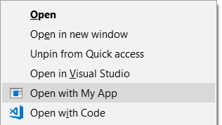

# Add item to Windows shell context menu to open your application

> Read the full article [here](http://www.reza-aghaei.com/how-to-add-item-to-windows-shell-context-menu-to-open-your-application/).

In this post I'll show how to that for context menus for *Folders* using a Visual Studio Setup Project, so after installing the application, when you right click on a folder, you can see such menu and when you click the menu, folder path will be passed to your application as command-line argument:

To add an item to context menu of folder, the setup should do the following configurations in registry:

<!-- language: lang-none -->

    HKEY_CLASSES_ROOT
        Directory
            shell
                OpenWithMyApp  → (Default): Text of the menu
                                 Icon:      "Path to executable" 
                    command    → (Default): "Path to executable" "%V"